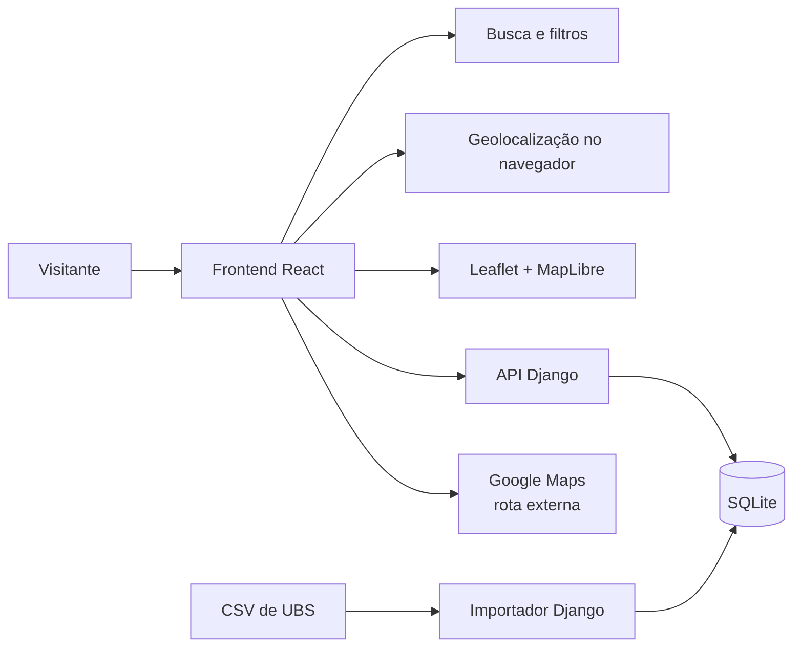

# UBS Digital

> Plataforma web para encontrar Unidades Básicas de Saúde no Recife de forma simples, visual e acessível.

O **UBS Digital** é um MVP acadêmico desenvolvido para centralizar informações de unidades de saúde, facilitar buscas por localização e ajudar o cidadão a identificar opções próximas. A aplicação funciona em modo visitante, sem conta, senha ou coleta de dados de saúde.

Os dados utilizados vieram do CSV fornecido para o projeto. Telefone, horário e serviços não são atualizados em tempo real e devem ser confirmados antes da visita.

## Problema

Informações sobre Unidades Básicas de Saúde podem estar espalhadas em diferentes fontes ou ser difíceis de consultar pelo celular. Isso dificulta encontrar uma unidade por bairro, endereço, atendimento oferecido ou proximidade.

## Objetivo

Reunir os dados das UBS em uma interface responsiva que permita pesquisar unidades, visualizá-las no mapa, calcular a distância aproximada e abrir a rota até o local escolhido.

## Público-alvo

- Moradores do Recife procurando uma UBS.
- Pessoas que precisam consultar endereço, telefone ou horário de uma unidade.
- Usuários de celular que desejam localizar atendimento próximo.
- Professores e estudantes avaliando o MVP e sua documentação técnica.

## Escopo do MVP

- Acesso como visitante, com nome opcional salvo apenas no navegador.
- Busca por nome da UBS, bairro ou endereço.
- Filtros por bairro, rua e atendimento informado.
- Exibição das unidades em lista e mapa interativo.
- Geolocalização opcional do visitante.
- Cálculo da distância aproximada por Haversine.
- Ordenação das unidades pela proximidade.
- Consulta de endereço, telefone, horário e atendimentos.
- Abertura da rota no Google Maps.
- Opção **Sair** no menu do visitante para reiniciar a experiência.
- Layout responsivo e instalação como PWA quando suportada pelo navegador.

## Requisitos principais

| ID | Requisito funcional |
| --- | --- |
| RF01 | O sistema deve permitir acesso sem cadastro ou autenticação. |
| RF02 | O visitante deve poder informar um nome opcional ou continuar anonimamente. |
| RF03 | O sistema deve permitir buscar UBS por nome, bairro e endereço. |
| RF04 | O sistema deve permitir filtrar unidades por bairro, rua e atendimento. |
| RF05 | O sistema deve apresentar as UBS em mapa e lista. |
| RF06 | Com autorização do navegador, o sistema deve calcular e ordenar as unidades por distância. |
| RF07 | O sistema deve exibir informações detalhadas da unidade selecionada. |
| RF08 | O visitante deve poder abrir a rota da UBS no Google Maps. |
| RF09 | O visitante deve poder sair e retornar à tela inicial. |

| ID | Requisito não funcional |
| --- | --- |
| RNF01 | A interface deve se adaptar a computadores, tablets e celulares. |
| RNF02 | A localização não deve ser gravada no banco nem enviada à API. |
| RNF03 | A aplicação deve oferecer mensagens compreensíveis em falhas de API ou geolocalização. |
| RNF04 | Os dados locais e a API devem usar UTF-8 e coordenadas numéricas válidas. |
| RNF05 | O mapa deve manter as atribuições exigidas pelos provedores cartográficos. |

## Como funciona



O React consulta `GET /api/ubs/`. O Django lê somente as unidades ativas do SQLite e devolve os dados em JSON. A localização é usada apenas no navegador para calcular a distância até cada coordenada da base.

O botão de rota abre o Google Maps com a latitude e longitude da UBS como destino. O Google Maps calcula o trajeto pelas ruas fora do UBS Digital.

## Tecnologias

| Área | Tecnologias |
| --- | --- |
| Interface | React 19, JavaScript e Vite |
| Estilos | CSS responsivo e Lucide Icons |
| Mapa | Leaflet, MapLibre GL e OpenFreeMap |
| Dados cartográficos | OpenStreetMap e OpenMapTiles |
| Backend | Python e Django 5.2+ |
| Banco | SQLite |
| Testes | Vitest, Testing Library e Django TestCase |
| Aplicativo instalável | Web App Manifest e Service Worker |

## Estrutura do projeto

```text
Ubs-Digital/
├── backend/
│   ├── apps/unidades/         # modelo, API, importador e testes
│   ├── config/                # configurações e rotas Django
│   ├── data/ubs_recife.csv    # base fornecida para o projeto
│   ├── scripts/               # geração dos dados de demonstração
│   ├── exemplo_ubs.csv        # exemplo do formato de importação
│   ├── server.py              # inicializador simplificado
│   └── manage.py
├── frontend/
│   ├── public/                # manifesto, service worker e ícones
│   ├── src/components/        # telas, mapa, cartões e modal
│   ├── src/hooks/             # busca e geolocalização
│   ├── src/services/          # API e modo demonstração
│   ├── src/styles/            # estilos da aplicação
│   ├── src/test/              # testes do frontend
│   └── src/utils/             # distância e nomes das unidades
├── .editorconfig
├── .gitignore
├── LICENSE
└── README.md
```

## Execução completa

### Pré-requisitos

- Python 3.11 ou superior.
- Node.js 20 ou superior.
- npm.
- Internet para carregar o mapa.

### 1. Preparar o backend

Abra um terminal na pasta do projeto:

```bash
cd backend
python -m venv .venv
```

Instale as dependências uma única vez:

```bash
# Windows PowerShell
.\.venv\Scripts\python.exe -m pip install -r requirements.txt

# Linux ou macOS
.venv/bin/python -m pip install -r requirements.txt
```

Inicie o backend:

```bash
python server.py
```

O `server.py` encontra automaticamente o Python da `.venv`; não é necessário ativá-la. Na primeira execução ele aplica as migrações, cria o SQLite e importa as UBS.

Backend disponível em `http://127.0.0.1:8000`.

### 2. Iniciar o frontend

Em outro terminal:

```bash
cd frontend
npm install
npm run dev
```

Abra `http://localhost:5173` no navegador. O Vite encaminha as chamadas de `/api` para o backend local.

No Windows, se o PowerShell bloquear `npm.ps1`, utilize:

```powershell
npm.cmd install
npm.cmd run dev
```

## Modo demonstração sem backend

Crie `frontend/.env` com:

```env
VITE_DEMO_MODE=true
VITE_API_BASE_URL=
```

Depois execute:

```bash
cd frontend
npm install
npm run dev
```

Nesse modo, as unidades são carregadas de `frontend/src/data/ubs_recife_demo.json`.

## Como usar

1. Acesse a tela inicial.
2. Escolha **Começar agora** para informar um nome ou **Entrar como visitante**.
3. Pesquise por unidade, bairro ou endereço.
4. Use filtros para refinar os resultados.
5. Clique em **Usar minha localização** para ordenar por proximidade.
6. Selecione uma UBS para consultar seus detalhes.
7. Use **Ver rota no Google Maps** para abrir o trajeto.
8. Clique no nome no topo e selecione **Sair** para reiniciar a experiência.

## Testes

Frontend:

```bash
cd frontend
npm test
npm run build
```

Backend:

```bash
cd backend
python manage.py test
python manage.py check
```

Os testes cobrem carregamento dos dados, API, importação do CSV, busca, filtros, distância, geolocalização negada, detalhes da UBS e saída do visitante.

## Atualização dos dados

Para importar novamente o CSV:

```bash
cd backend
python manage.py importar_ubs data/ubs_recife.csv
```

Para regenerar o JSON do modo demonstração:

```bash
python backend/scripts/preparar_dados_demo.py
```

## Privacidade

- Não há criação de conta ou autenticação.
- O nome é opcional e fica somente no `localStorage` do navegador.
- A localização fica apenas na memória da aba e é apagada ao sair.
- O backend não recebe a localização do visitante.
- Não são coletados CPF, Cartão SUS, prontuário ou informações clínicas.

## Limitações conhecidas

- A distância é calculada em linha reta e pode diferir do percurso viário.
- A geolocalização em celular requer HTTPS ou contexto seguro.
- O mapa depende de conexão com a internet.
- A base não possui atualização automática com uma fonte oficial.
- O SQLite atende ao escopo deste MVP acadêmico.

## Autoria e licença

Projeto acadêmico desenvolvido por **Mateus Lima**. Código disponibilizado sob a licença [MIT](LICENSE).

Os mapas mantêm as atribuições exigidas por OpenFreeMap, OpenMapTiles e OpenStreetMap.
