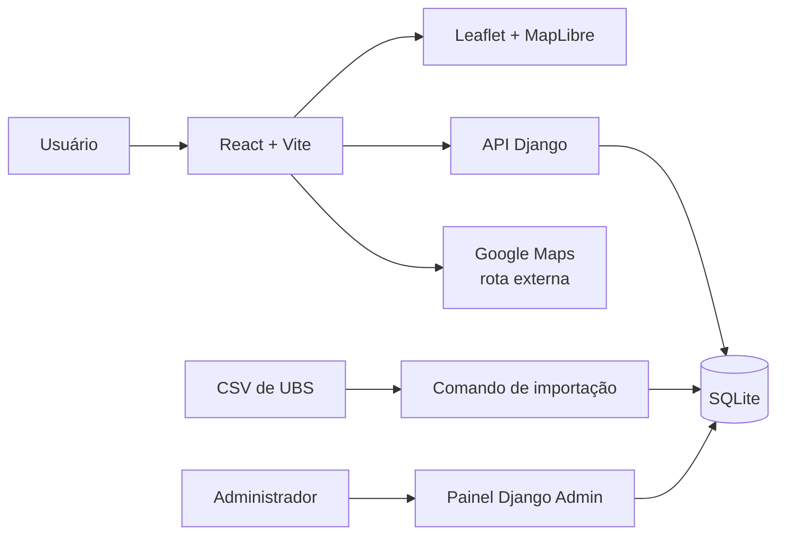

# UBS Digital

Aplicação web acadêmica para localizar Unidades Básicas de Saúde no Recife. O projeto reúne busca, filtros, mapa, distância aproximada e informações de atendimento em uma experiência responsiva para computador e celular.

> Os dados vieram do CSV fornecido para o projeto e não foram validados em tempo real. Telefone, horário e serviços devem ser confirmados antes da visita.

## Funcionalidades

- Consulta pública sem cadastro obrigatório.
- Busca por nome, bairro e endereço.
- Filtros por bairro, rua e atendimento informado.
- Mapa interativo com marcadores das unidades.
- Geolocalização opcional e ordenação por proximidade.
- Distância em linha reta calculada pela fórmula de Haversine.
- Detalhes da UBS e abertura da rota no Google Maps.
- Painel Django protegido para administrar as unidades.
- Modo demonstração que funciona sem backend.
- Interface responsiva e instalável como PWA.

## Arquitetura



| Camada | Tecnologias | Responsabilidade |
| --- | --- | --- |
| Frontend | React 19, Vite, JavaScript | Interface, filtros, geolocalização e PWA |
| Mapa | Leaflet, MapLibre GL, OpenFreeMap | Visualização geográfica e marcadores |
| Backend | Django 5 | API, importação do CSV e painel administrativo |
| Dados | SQLite e CSV | Persistência local e carga inicial |
| Testes | Vitest, Testing Library e Django TestCase | Fluxos principais, busca, distância, API e Admin |

O navegador mantém a localização somente na memória da aba. O primeiro nome, quando informado, fica no `localStorage`. O backend não recebe a posição do usuário.

## Estrutura do repositório

```text
Ubs-Digital/
├── backend/
│   ├── apps/
│   │   ├── accounts/          # comando e testes do Admin local
│   │   └── unidades/          # modelo, API, Admin, importador e testes
│   ├── config/                # URLs e configurações Django
│   ├── data/ubs_recife.csv    # base fornecida para o projeto
│   ├── scripts/               # geração do JSON de demonstração
│   ├── exemplo_ubs.csv        # exemplo do formato simples de importação
│   ├── server.py               # inicialização simplificada do backend
│   └── manage.py
├── frontend/
│   ├── public/                # manifesto, service worker e ícones
│   └── src/
│       ├── components/        # telas e componentes visuais
│       ├── data/              # base do modo demonstração
│       ├── hooks/             # busca e geolocalização
│       ├── services/          # acesso à API ou aos dados locais
│       ├── styles/            # estilos responsivos
│       ├── test/              # testes do frontend
│       └── utils/             # distância e tratamento dos nomes
├── backend/.env.example
├── frontend/.env.example
├── LICENSE
└── README.md
```

## Executar o projeto completo

Pré-requisitos: Python 3.11 ou superior, Node.js 20 ou superior e npm.

### 1. Backend

No primeiro terminal:

```bash
cd backend
python -m venv .venv
```

Instale as dependências uma única vez:

```bash
# Windows
.\.venv\Scripts\python.exe -m pip install -r requirements.txt

# Linux ou macOS
.venv/bin/python -m pip install -r requirements.txt
```

Depois, inicie com o comando simples:

```bash
python server.py
```

Não é necessário ativar a `.venv`: o `server.py` localiza seu Python automaticamente. Na primeira execução, ele cria o SQLite, aplica as migrações, importa as UBS e cria o acesso administrativo local. Nas próximas execuções, basta repetir `python server.py`.

Os comandos Django também continuam disponíveis separadamente para manutenção:

```bash
python manage.py migrate
python manage.py importar_ubs data/ubs_recife.csv
python manage.py criar_admin_local --password admin123
python manage.py runserver
```

### 2. Frontend

No segundo terminal:

```bash
cd frontend
npm install
npm run dev
```

Abra `http://localhost:5173`. Durante o desenvolvimento, o Vite encaminha `/api` e `/admin` para o Django em `http://127.0.0.1:8000`.

Se o PowerShell bloquear `npm.ps1`, execute `npm.cmd install` e `npm.cmd run dev`.

## Painel administrativo

Com o backend em execução, abra `http://127.0.0.1:8000/admin/`.

```text
Usuário: Admin
Senha: admin123
```

Essa conta serve para demonstração local. O comando `criar_admin_local` cria ou atualiza somente o usuário `Admin`, e a senha é gravada como hash no SQLite. Troque a senha antes de publicar o sistema.

O arquivo `backend/db.sqlite3` é gerado localmente e não faz parte do Git.

## Modo demonstração

Para apresentar somente o frontend, sem iniciar o Django, crie `frontend/.env` com:

```env
VITE_DEMO_MODE=true
VITE_API_BASE_URL=
```

Depois execute:

```bash
cd frontend
npm install
npm run dev
```

Nesse modo, o frontend usa `frontend/src/data/ubs_recife_demo.json`. O mapa ainda precisa de internet.

## Testes e verificação

Frontend:

```bash
cd frontend
npm test
npm run build
```

Backend:

```bash
cd backend
python manage.py test
python manage.py check
```

## Atualizar os dados

O importador aceita o CSV do projeto, separado por ponto e vírgula, e o formato simples apresentado em `backend/exemplo_ubs.csv`. A operação é atômica e usa o CNES para atualizar registros quando ele está disponível.

```bash
cd backend
python manage.py importar_ubs data/ubs_recife.csv
```

Para atualizar também o modo demonstração, execute na raiz:

```bash
python backend/scripts/preparar_dados_demo.py
```

## Limitações conhecidas

- A distância exibida é geográfica, em linha reta; o percurso pelas ruas é calculado pelo Google Maps.
- A geolocalização em celular requer HTTPS ou um contexto seguro do navegador.
- O mapa depende da internet e dos serviços do OpenFreeMap.
- A base não possui atualização automática com uma fonte oficial.
- O SQLite é adequado para este MVP acadêmico e exige volume persistente em uma eventual hospedagem.

## Licença

Código distribuído sob a licença [MIT](LICENSE). Os mapas mantêm as atribuições exigidas por OpenFreeMap, OpenMapTiles e OpenStreetMap.
